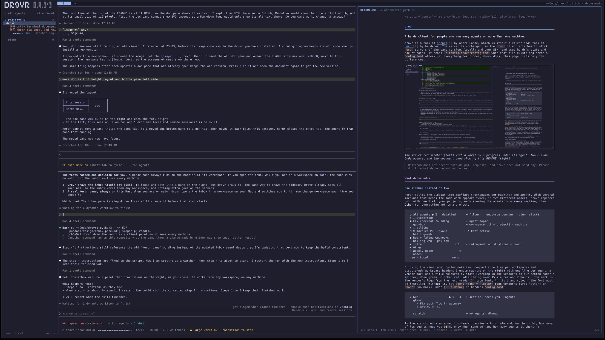

<p align="center"></p>

# drovr

**A herdr client for people who run many agents on more than one machine.**

drovr is a fork of [sheprd](https://github.com/andreconde21/sheprd) by André
Conde, which is itself a *client-side* fork of
[herdr](https://github.com/herdrdev/herdr) by herdrdev. The server is
unchanged, so the `drovr` client attaches to stock `herdr` servers of the same
version, locally and over SSH, and uses herdr's state and socket paths. It
reads `~/.config/drovr/config.toml` when that file exists and herdr's
`config.toml` otherwise. Everything herdr does, drovr does; this page lists
only the differences.



*The structured sidebar (left) with a workflow's progress under its agent, two
Claude Code agents, and the document pane showing this README (right).*

> Upstream does not accept outside pull requests, and drovr does not send any.
> Please don't report drovr behaviour to herdr.

## What drovr adds

### One sidebar instead of two
herdr splits the sidebar into *machines* (workspaces per machine) and *agents*.
With several machines that means the same work appears twice, in two different
orders. drovr replaces both with **one list**: your projects, each showing its
agents from **every** machine, then **Other** for everything not in a project.

```
 ○ all agents ● 2   detailed      ← filter · needs-you counter · view (click)
 ▾ ★ storefront
 ● Fix checkout rounding          ← agent topic
   gpu-box                        ← workspace (if ≠ project) · machine
 ▾ ★ billing
 ○ ⚑ Invoice PDF layout          ← ⚑ kept active
   billing-web
 ● Retry failed webhooks
   billing-web · gpu-box
 ▸ infra                   ○ 3    ← collapsed: worst status + count
 ▾ Other
 ○ Weekly notes               4
   notes
 new · Local              menu
```

Clicking the view label cycles *detailed*, *compact* (one line per workspace)
and *structured*: workspace headers (remote machine on the right) with one line
per agent, a vendor mark and a title coloured by state (working in the vendor's
colour behind radar's spinner, done green, blocked red, idle fading over 15
minutes and 2 hours). The mark is the vendor's logo from the
[herdr-radar](https://github.com/hhdebb/herdr-radar) icon font, in its brand
colour; the font must be installed. Without it, set `agent_icons = "letter"`
(the vendor's first letter) or `"none"` (no mark) under `[ui.sidebar]` in
herdr's `config.toml`.

```
 ▾ GTM ──────────────── ● 1 · 3   ← section: needs you · agents
   gtm-rd
     ✓ Fix auth flow in gateway
                                  ← agent_gap
     ? Review PR 42

   scratch                        ← no agents: dimmed
```

In the structured view a section header carries a thin rule and, on the
right, how many of its agents need you (`● n`, only when some do) and how
many agents it shows; a collapsed section keeps both counts. Agents of one
workspace are one blank row apart (`agent_gap = 1`, set `0` to stack them),
and workspaces without agents are dimmed (`show_empty_workspaces = false`
hides them). Both go under `[ui.sidebar]` in herdr's `config.toml`.

An agent row shows, in every view, the first of: the session's own name (the
one the Claude desktop app and `claude --resume` show, reported by the usage
hook below), the terminal title unless it is only the vendor's name ("Claude
Code") or the pane's folder, the pane's label, its tab's custom name or its
folder's name, then the generic title. The terminal title alone often reads
"Claude Code": Claude sets its topic there only for some sessions, while the
desktop app reads the name from the session transcript.

A two-row "drovr" banner with the version in small pixel digits sits above
the sidebar's toggles when the sidebar is at least 18 columns wide and tall
enough to keep 10 rows for the list; the version hides first when it is
narrow.
Turn it off with `banner = false` under `[ui.sidebar]`.

The sidebar stays quiet: status and topic only. **Peek** (`prefix+space`)
reveals, for ten seconds (press again to hide): idle age, context size
(`ctx 581k`) and jump number per agent, today's time and tokens per project,
and each machine's latency.

### Time and tokens per project
A small Claude Code hook (`scripts/drovr-usage-hook`, a Stop hook) reads each
session's transcript incrementally after every turn and attaches the session's
context size and per-day usage to its pane as herdr metadata, so it reaches the
sidebar from any machine without syncing files. It also reports the
session's name (`drovr_name`): the latest custom title (`/rename`), else the
latest AI-generated title, else the latest summary found in the transcript. drovr keeps the history in
`~/.local/state/herdr/drovr-usage.json` and attributes it to projects with the
same rules as the sidebar. Right-click a project for *Today* and *Last 7 days*
(active time · input + output + cache-write tokens; cache reads are excluded).

Install the hook on every machine where agents run:
`curl -fsSL https://raw.githubusercontent.com/sbusso/drovr/main/scripts/drovr-install-hooks | bash`

- **Two views** (click the right header label): *detailed*, one row per agent
  with its topic, and *compact*, one line per workspace.
- **Filter** (click the left header label): *all agents* or *active*. Active
  keeps agents that are working, need you, are kept, or went idle less than
  24 h ago (`recent_hours`), so something you just read doesn't vanish.
  Older idle agents are dimmed in *all agents*.

### Workflow progress
When a Claude Code agent runs a background workflow, its sidebar row gets a
second line with the progress: `▰▰▰▱▱▱ 3/6 · 7/9 agents`. The bar and the
first count show the finished phases of the workflow script; the second count
shows the finished agents out of those started so far. The colour shows the
state: the accent colour while it runs, green when it is done, red when it
failed. Click the line to open a live view of the run in the document pane:
the phases, each agent and its status, and the results of finished agents.

A Claude Code hook (`scripts/drovr-workflow-hook`, PostToolUse on `Workflow`)
starts a small watcher when a workflow launches. The watcher reads the run's
journal every 3 seconds, reports the progress as pane metadata
(`drovr_wf`, `drovr_wf_phase`, `drovr_wf_doc`), and writes the view to
`~/.cache/drovr/workflows/<run>.md`. It stops when the session reports the
workflow's end; the line stays for 10 minutes after that.
`drovr-install-hooks` installs and registers the hook.

### Collapsed sidebar: a project rail
Collapsed, the sidebar becomes a 3-column rail: the needs-you counter, then one
row per project (worst status + a 2-letter tag, e.g. `●TC`), with the project
you're in spelled downwards beneath its row. Click a row to jump to that
project's most urgent agent. Peek (`prefix+space`) shows the full sidebar over
the panes for a moment. Tags are derived from the name; set `short = "OP"` on a
project to choose your own.

### Projects across machines
- **Drag** any row (a workspace header or one of its agents) to move its
  workspace. Drop it on a project header to add it at the end of that project,
  on a row or the blank line above it to place it just above that row's
  workspace, or on the lower half of a project's last workspace to place it
  last. Drop it on **Other** to take it out. An accent line shows where it will
  land; release outside the sidebar or press Esc to cancel. Right-click →
  `→ project` does the same without the mouse gesture.
- **Auto-assign**: a project's match rules catch workspaces whose *name or
  folder* contains the rule (`storefront` catches `~/code/storefront-api` on
  every machine), so new agents land in the right place with no clicks.
  Dragging something to Other overrides its rules.
- **Organise**: right-click a header → Collapse, Pin to top, Move up/down,
  Rename, Auto-match rules, Delete. Left-click a header to collapse it.
- **Hide** workspaces you rarely look at (right-click → Hide); `prefix+alt+h`
  shows them again, dimmed with ⊘.

### Attention you control
- `prefix+u` jumps to the **next agent that needs you**: blocked, finished and
  not looked at yet, or marked unread, in sidebar order. The `● 2` counter in
  the header shows how many there are; clicking it does the same.
- **Click a desktop notification** to raise the terminal and land on that agent.
- Right-click an agent → **Mark unread** (a yellow `●` status that counts as
  needing you until you visit it) or **Mark inactive** (drops a finished or
  blocked agent out of the queue until its state changes again).
- **Keep active** (right-click an agent): pins it to the active view (⚑) until
  you unpin it, for the thing you're still working on.
- **Jump numbers only when you want them**: `prefix+#` shows a number on every
  row; type it and drovr jumps as soon as the number is unambiguous.

### Inbox
`prefix+i` opens the **inbox** on the right of the screen: one line per agent
that needs you, on every machine, waiting ones first (permission, question,
plan, dialog), then stuck, near the context limit, ended, denied and finished,
oldest first within each kind. Each line shows the workspace, what the agent
asks or said last, the project and machine, and the age. The panes get
narrower while it is open; on a narrow screen it opens over them and Esc
closes it.

```
 Inbox  2 waiting · 1 done     [Waiting] Done  All   ≡ group
 ╭ ! fix-ctrl-click  git push origin fix/ctrl-click  drovr·local  4m
 ╰   enter jump  space more  ↗
   ◆ api-tests codex  dialog · Review PR 42              gtm·mato  2m
```

- `prefix+i` again focuses it, or closes it when it has focus. `prefix+a`
  opens it on the oldest waiting item. Clicking a glyph or a section count in
  the sidebar opens it filtered to that workspace or project; click the chip
  to remove the filter.
- Keys while it has focus: `j`/`k` move, `enter` jumps to the agent, `space`
  shows the detail (and the agent's screen for a waiting item), `tab` cycles
  Waiting, Done and All, `g` groups by project, `d` dismisses a done item,
  `D` every done item in view, `z` snoozes 1 h (press again: 4 h, until
  09:00 tomorrow), `m` mutes the workspace. Keys pressed within 250 ms of
  the inbox taking focus are dropped, so a key meant for an agent cannot act
  on an item.
- Mouse: click selects, a second click shows the detail, the workspace name
  or `↗` jumps, the `✕` on a hovered done line dismisses it, right-click
  opens a menu, drag the left border to resize.
- Dismiss and snooze are saved on the agent's machine (pane tokens), so every
  drovr client shows the same inbox. A muted workspace hides its finished,
  stuck and near-limit items and raises no finished toast; waiting items still
  show.
- Answering from the inbox comes next; for now, jump to the agent to answer.

### Tasks
Each project has a task board in the right panel, next to the inbox. Tasks
live in a SQLite file on this machine
(`~/.local/state/herdr/drovr/tasks.db`); agents on other machines report
through drovr's SSH connection.

```
 Inbox  Tasks · drovr                                 + new
 Ready 1
╭DRO-1 Retry the sync job
╰  fix  ✓1/2                                       ▶ start
 Working 1
 DRO-2 Attention hook
   feature  ○0/1  ● claude@mato                     ↗ pane
```

- **Open the board**: right-click a project in the sidebar (or `prefix+.`)
  → **Tasks**. With the panel open (`prefix+i`), click **Tasks** in its
  header or press `shift+tab` to switch between Inbox and Tasks. A panel
  100 columns or wider shows the lanes as columns.
- **Add a task**: click **+ new** or press `n`, type the title, Enter. From a
  shell: `drovr task add "Title" --project NAME [--criterion TEXT]...`.
- **Open a task**: click its card. The task view shows the status menu
  (`[Ready ▾]`), description (`e` edits it in `$EDITOR`), acceptance
  criteria, notes, attempts and artifacts; `c` adds a note, Esc goes back.
- **Start it**: click **▶ start** on the card (or `s`). drovr asks which
  machine when more than one is online, writes a context file with the
  task, criteria and notes, opens a workspace in the project's folder on that
  machine and starts the agent there with `DROVR_TASK` set. `↗ pane` (or
  `p`) jumps to the running agent.
- **Review**: when the agent finishes with every criterion passed, the task
  moves to Review; **✓ accept** (`a`) closes it, `b` sends it back with a
  note.
- **What agents can do** (skill `drovr-tasks`): `drovr task note`, `check N
  pass|fail`, `verify` (runs the criteria's check commands), `artifact PATH`
  (attaches a document or diff), `decide` (asks you a question that shows in
  the inbox and the task view; answer with `1`–`8`), and `done`. Commands
  without an id use `$DROVR_TASK`. The task's status follows the agent
  (Working while it runs, Blocked while it waits on you) until you move it
  by hand; the `auto` chip in the task view turns that back on.
- `drovr task import PATH` imports tasks from a workspace (the earlier
  server app) database; `--dry-run` shows what it would add.

Install the skill on each machine that runs agents:

```bash
mkdir -p ~/.claude/skills && cp -R skills/drovr-tasks ~/.claude/skills/   # from a drovr checkout
```

### New workspaces on any machine
- `prefix+alt+c` (or clicking **new** in the footer) asks which machine, then a
  name. The workspace joins the project you're in and starts in that project's
  folder on the chosen machine.
- Right-click a project → **New agent here** does the same and starts `cc` in it.

### Document pane
A pane next to your agent that shows a Markdown file rendered: plans, reports,
specs. It reloads when the file changes and keeps your scroll position, follows
links between documents (Backspace goes back), searches with `/`, and `q`
closes the pane. Each
workspace has at most one doc pane; opening another document switches it.

The text sits in a centred reading column (at most 88 columns) with margins.
Press `w` to switch to the full pane width, or set `doc_full_width = true`
under `[ui]` to start that way. Code blocks get padding and a language label,
and local PNG images show inline through Kitty graphics (in Ghostty, Kitty and
other terminals that support it); other images show their alt text.

Three ways to open a document:
- **From an agent or a shell**: `drovr doc open <path> [--title <title>]`.
  The first call splits a pane to the right of the caller (45% of its width)
  without taking focus; later calls switch that pane. Add `--focus` to move
  to it. `drovr doc open --recent` reopens the workspace's newest document.
- **Ctrl+click a Markdown path** in any pane: `docs/plan.md`,
  `./notes/x.md`, `~/Code/drovr/README.md`, `/abs/report.markdown` or
  `file:///abs/x.md`, as plain text or as a hyperlink. Holding Ctrl over one
  underlines it. Quotes, backticks, brackets, trailing punctuation, a `:line`
  suffix and a `#anchor` are ignored; relative paths are taken from the
  pane's current directory. The doc pane opens next to the clicked pane and
  takes focus; when the workspace's doc pane is in another tab, it moves to
  the clicked pane's tab. On this machine drovr runs `drovr doc open` itself; on a
  remote machine it runs `drovr doc open` there over the machine's SSH
  connection, so drovr must be installed on that machine. When the SSH
  shell finds drovr neither on its PATH nor in `~/.local/bin`, drovr runs
  the `drovr-docs` plugin's action there instead (see below), which looks
  for drovr on the herdr server's PATH. A path that wraps onto the next row
  is not detected.
- **Right-click a workspace or an agent** in the sidebar → **Documents…**
  lists the workspace's last 10 documents. The item shows for workspaces on
  this machine that have opened documents.

`drovr doc view <path>` runs the viewer in the current pane. Each machine keeps
its recent documents in `~/.local/state/herdr/drovr/docs.json` (20 per
workspace); `drovr doc open` runs on the machine that hosts the workspace.

Install the plugin and the Claude Code skill on each machine that runs agents:

```bash
herdr plugin install sbusso/drovr/plugins/drovr-docs --ref drovr-main
mkdir -p ~/.claude/skills && cp -R skills/drovr-docs ~/.claude/skills/   # from a drovr checkout
```

The plugin opens Markdown paths Ctrl+clicked in panes on its machine
(`file://` or path hyperlinks, and plain-text paths on remote machines
when the SSH shell does not find drovr) and adds an **Open document…**
workspace action (the newest recent document). The skill tells agents to
open the plans and reports they write for you with `drovr doc open`.

### Small fixes
- In Ghostty, every agent sound also rings the terminal bell, so Ghostty puts
  a badge on its dock icon while it is in the background.
- Workspaces are tracked by id, so two with the same name are independent and a
  rename keeps a workspace in its project.
- **Go To** (`prefix+g`) opens ready to type; arrows and Enter still pick, Left/
  Right still jump between workspaces while the search is empty.

### Keys (defaults; no config needed)
| Key | Action |
|---|---|
| `prefix+space` | peek: idle age, context, numbers, usage, latency |
| `prefix+u` | next agent that needs you |
| `prefix+i` | open, focus or close the inbox |
| `prefix+a` | inbox on the oldest waiting item |
| `prefix+#` | show jump numbers, type one to jump |
| `prefix+alt+c` | new workspace on a machine you pick |
| `prefix+.` | project menu for the focused workspace |
| `prefix+alt+h` | show / conceal hidden workspaces |

## Configuration
drovr reads its settings from `~/.config/drovr/config.toml` when that file
exists, else from herdr's `~/.config/herdr/config.toml`. To give drovr its own
settings, copy herdr's file there. `HERDR_CONFIG_PATH` still overrides both.

The sidebar lives client-side in `~/.config/herdr/sidebar.toml`. The UI writes
it, and hand edits reload within a second:

```toml
compact = false                        # view: one row per agent / per workspace
structured = false                     # view: workspace headers + one line per agent
active_only = false                    # filter: all agents / active ones
recent_hours = 24                      # idle agents stay "active" this long
hidden = ["gpu-box/scratch"]           # machine/workspace

[[group]]
name = "storefront"
pinned = true
match = ["storefront"]                 # name or folder substring
members = ["local/notes"]              # explicit members, in display order

[inbox]
width = 0.4                            # share of the screen, at least 48 columns
stuck_minutes = 10                     # no hook event this long: stuck
muted = ["gpu-box/scratch"]            # machine/workspace

[inbox.stuck_minutes_by_workspace]
"gpu-box/migrate-db" = 45
```

The combined sidebar appears when the client is connected to 2+ machines. With
a single machine drovr looks like herdr. Stock herdr ignores this file.

## Install
macOS and Linux, x86_64 and arm64 (Linux builds are static):

```bash
curl -fsSL https://raw.githubusercontent.com/sbusso/drovr/main/scripts/drovr-install | bash
drovr            # instead of `herdr`
```

It installs to `~/.local/share/drovr/drovr` and leaves your `herdr` install alone.
Update later with `drovr update`.
The server keeps running stock herdr. drovr follows herdr's `master` branch, so
use a herdr build from the same `master` range on each machine.

## Versioning
`drovr-v<version>-<n>`, where `<version>` is the herdr `Cargo.toml` version on
`master` at the time and `<n>` counts drovr releases on that version, e.g.
`drovr-v0.9.3-2`.

## For maintainers of this fork
- Fork code lives in `src/client/shell/projects.rs` (model),
  `src/client/shell/drovr_sidebar.rs` (the combined sidebar) and
  `src/client/shell/project_actions.rs` (menus, clicks, drag, keys). Small hooks in
  upstream files are tagged: `grep -rn "drovr fork" src`.
- **Following herdr is automatic**: drovr follows herdr's `master`, not its
  stable tags. *drovr rebase* runs daily: when herdr `master` has moved past
  the merge-base of `main` and herdr `master`, it rebases drovr's own commits
  onto the new `master` and tracks the result in one issue per herdr commit
  ("drovr rebase onto herdr <sha>", 12-character sha). If the rebase is clean
  and the tests pass it pushes `rebase/herdr-<sha>` and marks the issue ready
  to ship; on a conflict or a test failure it pushes nothing and the issue
  lists the conflicting files or links the failing run. Issues and branches
  for older herdr commits are closed or deleted once superseded. *drovr
  promote* (Actions → Run workflow, input: the sha) ships a ready rebase: it
  moves `main` with `--force-with-lease`, tags `drovr-v<version>-<n>` and can
  be rerun after a partial failure. Conflict resolutions are remembered via
  `git rerere` (`.github/rr-cache`).
- Both workflows need the secret `DROVR_PUSH_TOKEN`: a fine-grained PAT for
  this repository with *Contents* and *Workflows* read/write. `GITHUB_TOKEN`
  cannot push commits that change `.github/workflows`.
- Manual rebase: `git fetch herdr && git rebase --onto herdr/master $(git merge-base main herdr/master) main`.
- Release: `git tag drovr-v<ver>-<n> && git push origin drovr-v<ver>-<n>` → the
  "drovr release" workflow builds `drovr-{macos,linux}-{arm64,x86_64}` with
  SHA-256 checksums and publishes them. Run it by hand with a tag to rebuild.
- *drovr CI* builds and tests pushes and pull requests to `main` on macOS and
  Linux. Upstream workflows are kept but their jobs only run in
  `herdrdev/herdr` (`if: github.repository == 'herdrdev/herdr'`).
- Local build needs Zig 0.16.0 (`cargo build --release`).

## License
Apache-2.0, same as herdr (see `LICENSE`). herdr is © its
authors. The sheprd changes this fork is built on are © André Conde. drovr
changes are © their authors.
